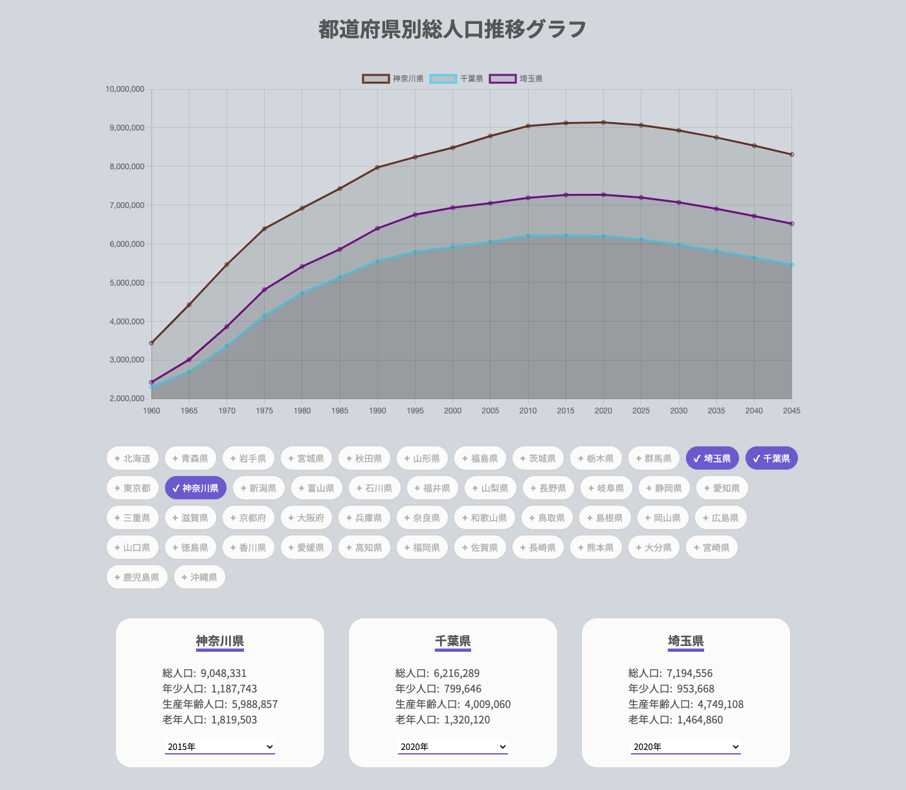

## 概要

- Reac.js を利用した都道府県別の総人口推移グラフを表示する SPA(Single Page Application)
- RESAS(地域経済分析システム) API から Axios を利用してデータを fetch する
- API レスポンスから都道府県一覧のチェックボックスを動的に生成する
- 都道府県にチェックを入れると、RESAS API から選択された都道府県の「人口構成」を取得する
- 人口構成 API レスポンスから、X 軸:年、Y 軸:人口数の折れ線グラフを動的に生成して表示する
- 都道府県にチェックを入れると、人口構成詳細を表示するカードが動的に生成される。
- カード内のセレクトボックスで選択された年代から、その年の詳細データが表示される。
- レスポンシブにも対応



## Demo Website

https://sudopain.github.io/population-graph-website/

## 使用手順

Github からソースコードを clone する

```shell
git clone https://github.com/sudopain/population-graph-website.git
```

dependencies をインストールする

```shell
npm install
```

ルートディレクトリに.env ファイルを作成し、以下の内容を入力してセーブする。

```shell
REACT_APP_API_KEY = *RESASから発行された、APIキーを入力する*
REACT_APP_API_KEY = *RESAS APIのurlを入力する*
```

build する

```shell
npm run build
```

お好みのホスティングサービスにデプロイする
